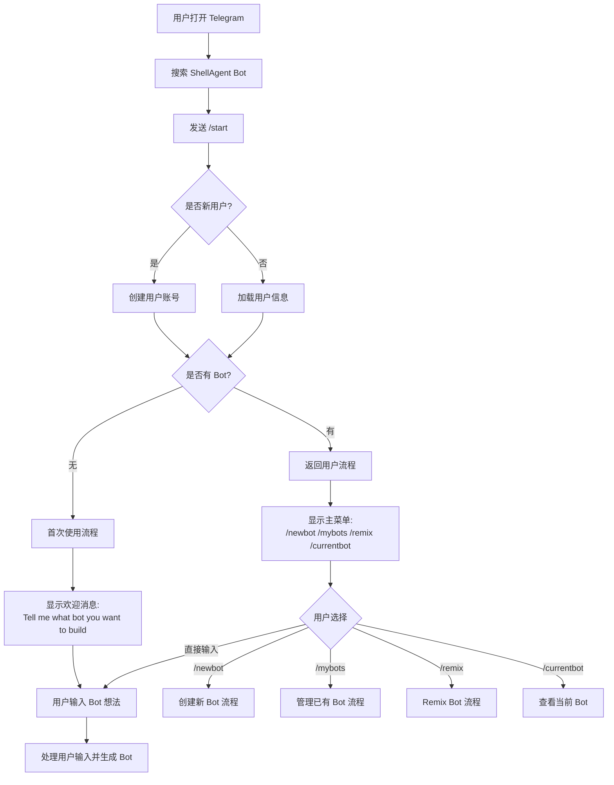
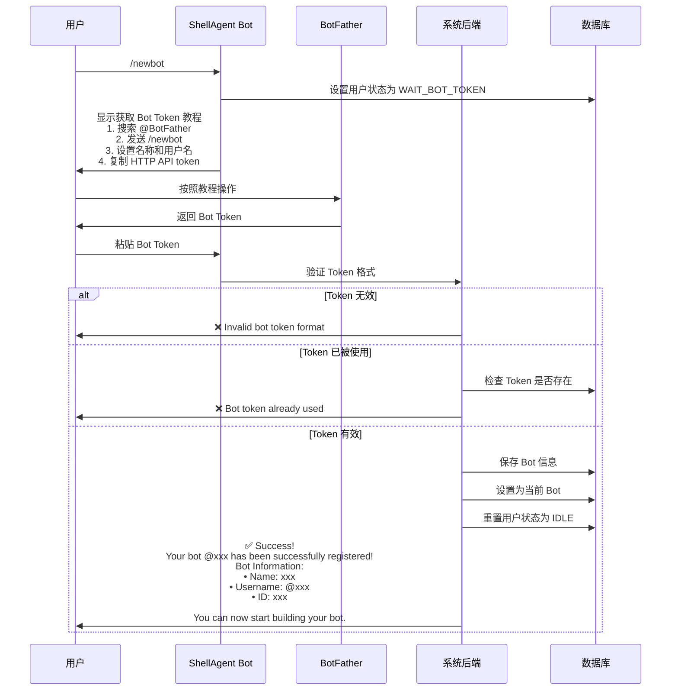
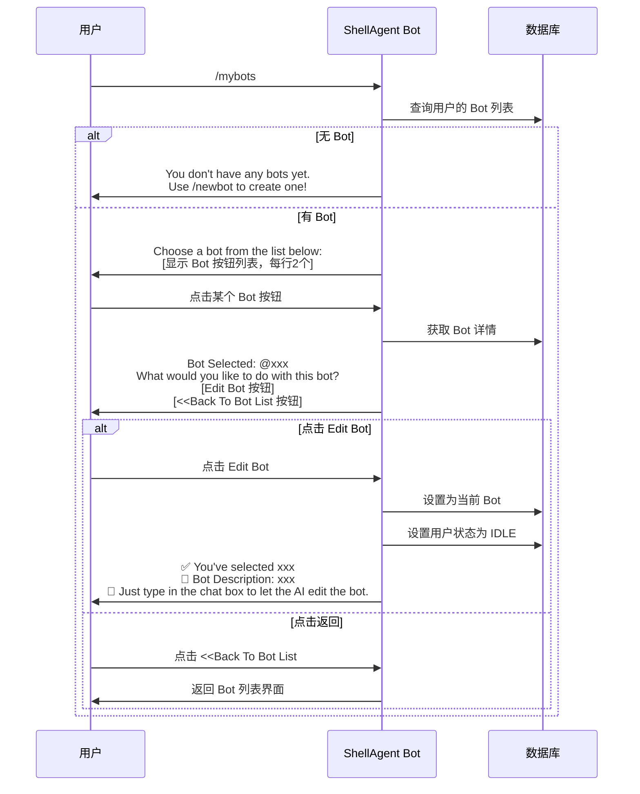
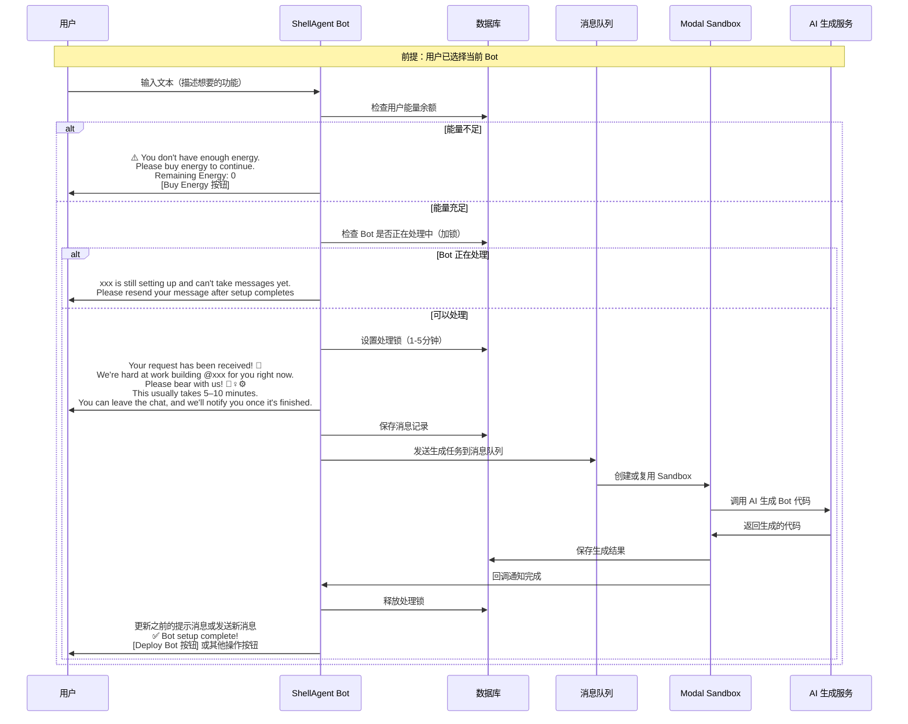
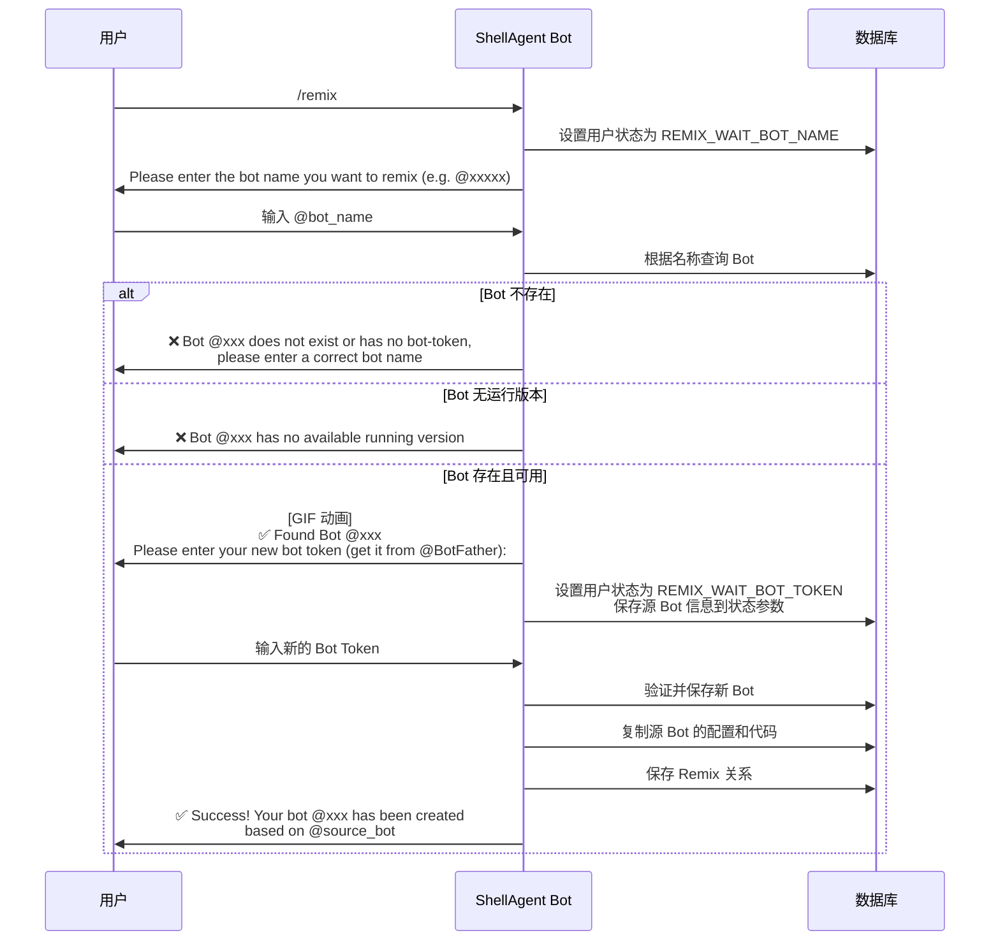
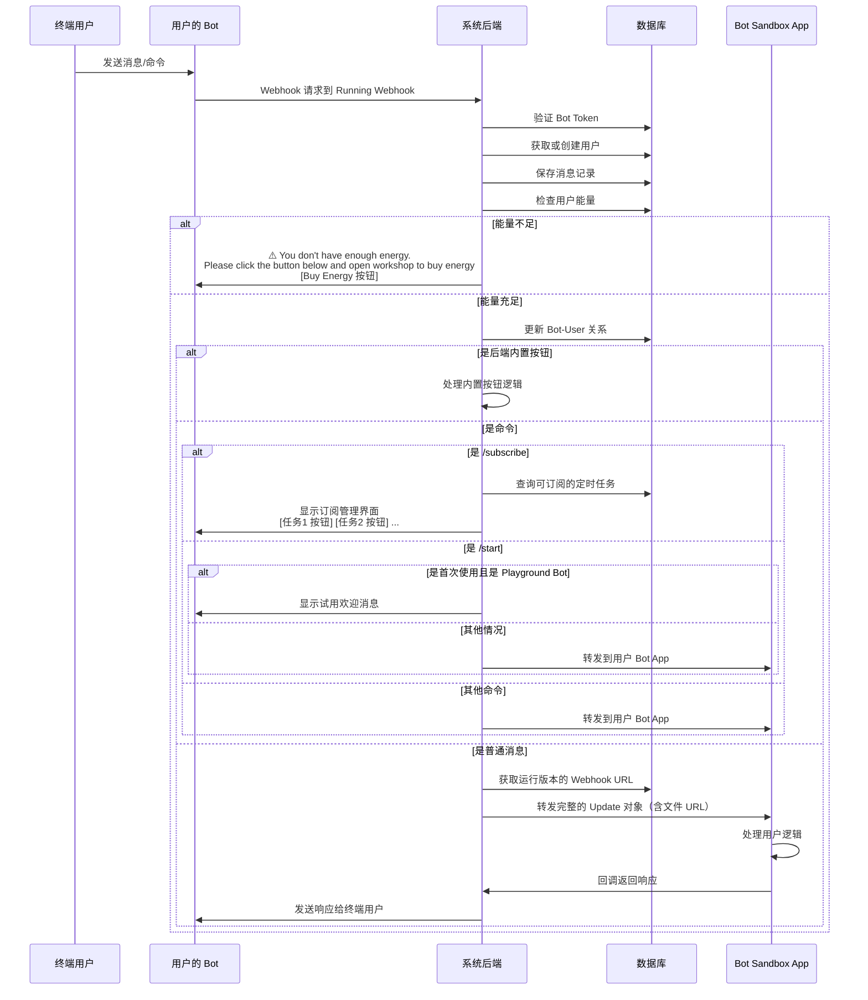
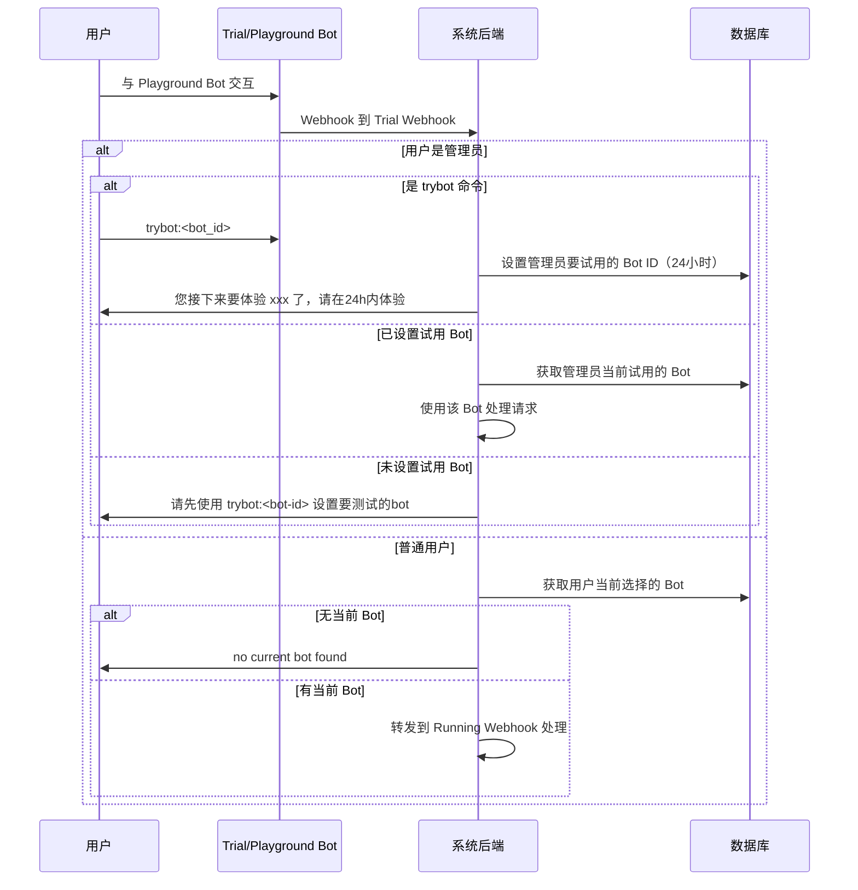
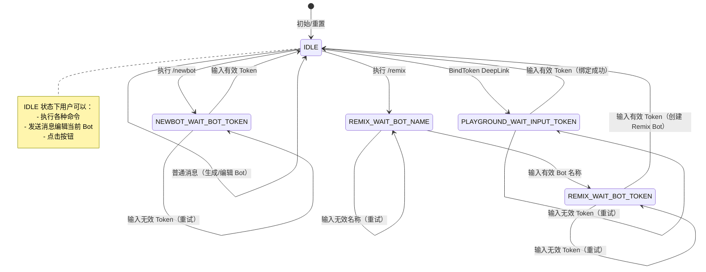

# Telegram Bot 交互流程图

## 1. 整体用户旅程



## 2. 创建新 Bot 流程（/newbot）



## 3. 管理已有 Bot 流程（/mybots）



## 4. Bot 编辑和生成流程



## 5. Remix Bot 流程



## 6. DeepLink 启动流程（带参数的 /start）

```mermaid
graph TD
    Start[用户点击 DeepLink] --> ParseParam{解析参数类型}

    ParseParam -->|s_kol_v_xxx| KolSource[KOL 来源]
    ParseParam -->|s_fb_v_xxx| FromBot[来自其他 Bot]
    ParseParam -->|s_egy_v_xxx| Energy[能量相关]
    ParseParam -->|s_rmx_v_xxx| RemixLink[Remix Bot]
    ParseParam -->|s_cpg_v_xxx| Campaign[活动来源]
    ParseParam -->|s_bdt_v_xxx| BindToken[绑定 Token]

    KolSource --> SaveInvite[保存邀请记录]
    FromBot --> SaveStats[保存统计数据]

    Energy --> CheckBots{是否有 Bot?}
    CheckBots -->|有| ShowEnergyBtn[显示: Click the button below to open workshop<br/>and buy energy or view details<br/>[Buy Or View Energy 按钮]]
    CheckBots -->|无| WelcomeMsg[显示欢迎消息]

    RemixLink --> CheckUserBots{用户是否有 Bot?}
    CheckUserBots -->|有| ShowRemixGuide[显示 Remix 教程:<br/>You're remixing @xxx. Before you start,<br/>you need to get your bot token. Here is how:<br/>1. Search @BotFather<br/>2. Tap Start<br/>3. Send /newbot<br/>...]
    CheckUserBots -->|无| CreateTrial[创建试用 Bot<br/>并显示: You're remixing @xxx.<br/>Tell me what bot you want to build based on it.]

    BindToken --> SetState[设置状态为 PLAYGROUND_WAIT_INPUT_TOKEN]
    SetState --> ShowTokenGuide[显示获取 Token 教程]

    SaveInvite --> Continue[继续正常流程]
    SaveStats --> Continue
    ShowEnergyBtn --> Continue
    WelcomeMsg --> Continue
    ShowRemixGuide --> Continue
    CreateTrial --> Continue
    ShowTokenGuide --> Continue

    Continue --> ShowFinal[显示最终欢迎消息或菜单]
```

## 7. 用户 Bot 运行流程（Running Webhook）



## 8. 试用 Bot 流程（Trial Webhook）



## 9. 用户状态机



## 10. 能量检查流程

```mermaid
graph TD
    UserAction[用户发送消息] --> CheckEnergy{检查能量余额}

    CheckEnergy -->|余额 = 0| NoEnergy[显示能量不足提示]
    CheckEnergy -->|余额 > 0| ProcessRequest[处理请求]

    NoEnergy -->|生成 Bot 场景| GenNoEnergy[⚠️ You don't have enough energy.<br/>Please buy energy to continue.<br/>Remaining Energy: 0<br/>[Buy Energy 按钮]]

    NoEnergy -->|运行 Bot 场景| RunNoEnergy[⚠️ You don't have enough energy.<br/>Please click the button below and<br/>open workshop to buy energy<br/>[Buy Energy 按钮]]

    GenNoEnergy --> TrackEvent[记录埋点事件]
    RunNoEnergy --> TrackEvent
    TrackEvent --> End[结束]

    ProcessRequest --> Continue[继续正常流程]
```
