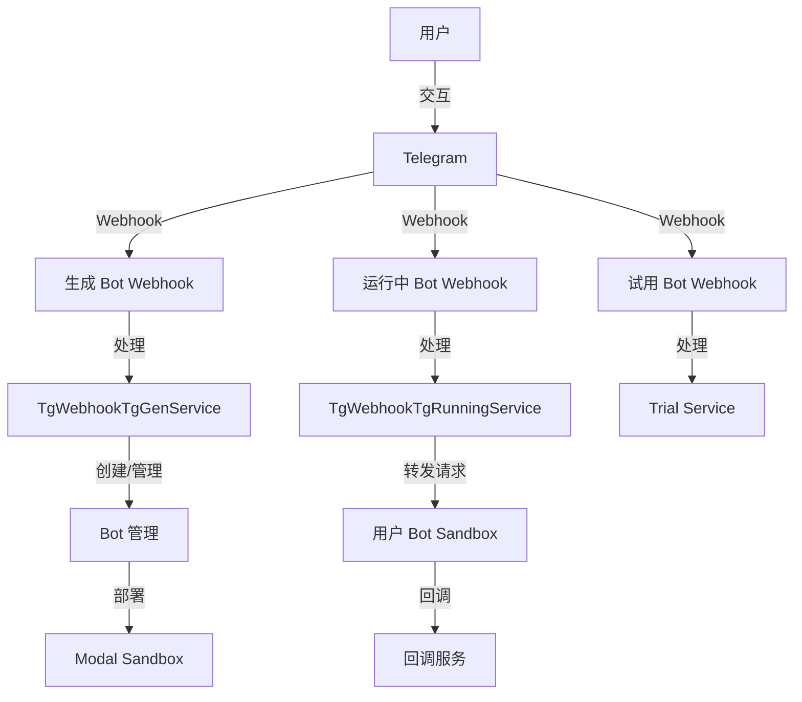

# Telegram Bot 交互文档

本文档详细描述了我们的 Telegram Bot 系统的用户交互流程。系统主要包含三个核心 Bot：

1. **ShellAgent Bot（生成 Bot）** - 用于创建和管理用户的自定义 Bot
2. **User Created Bots（运行中的 Bot）** - 用户创建的已部署 Bot
3. **Trial/Playground Bot** - 用于试用和测试的临时 Bot

## 文档结构

- [交互流程图](./interaction-flows.md) - 完整的用户交互流程图
- [消息文案汇总](./messages.md) - 所有 Bot 消息文案
- [命令详解](./commands.md) - 所有支持的命令说明
- [按钮交互](./buttons.md) - 所有按钮交互说明
- [状态机](./state-machine.md) - 用户状态流转说明
- [API 端点](./api-endpoints.md) - Webhook 端点说明

## 系统架构概览

## 三个核心 Webhook

### 1. Generate Webhook（生成 Bot）
- **端点**: `/v1/tg2app/telegram/generate/webhook`
- **用途**: 处理 ShellAgent Bot 的所有交互，用于创建和管理用户 Bot
- **Bot Token**: 固定的 ShellAgent Bot Token

### 2. Running Webhook（运行中 Bot）
- **端点**: `/v1/tg2app/telegram/running/webhook/{bot_id}/{bot_token}`
- **用途**: 处理用户已部署 Bot 的所有用户交互
- **Bot Token**: 用户自己的 Bot Token

### 3. Trial Webhook（试用 Bot）
- **端点**: `/v1/tg2app/telegram/trial/webhook`
- **用途**: 处理 Playground Bot 的交互，用于试用功能
- **Bot Token**: 固定的 Trial Bot Token

## 快速开始

1. 用户在 Telegram 中搜索并启动 ShellAgent Bot
2. 发送 `/start` 命令开始
3. 根据提示选择创建新 Bot 或管理现有 Bot
4. 按照向导完成 Bot 创建和配置
5. 部署后即可在自己的 Bot 中与用户交互
