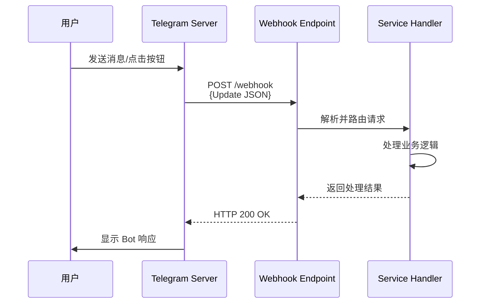
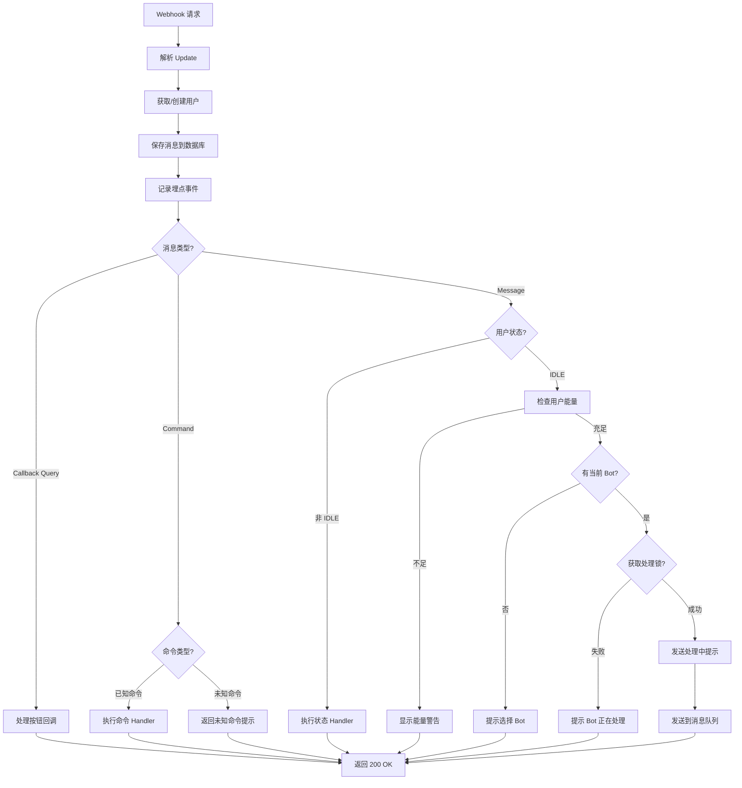
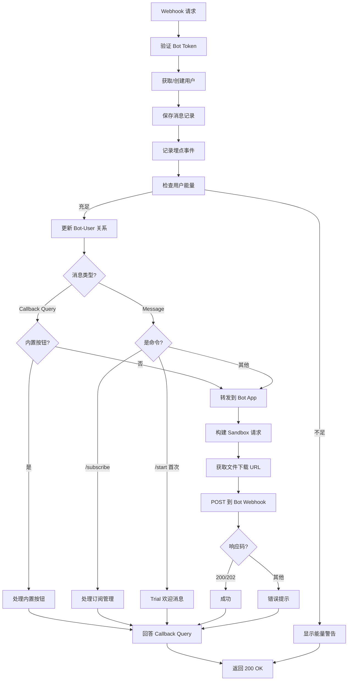

# API Webhook 端点详解

本文档详细说明所有 Telegram Webhook API 端点的配置和使用。

## 概述

系统通过 Telegram Webhook 机制接收用户消息和交互。当用户与 Bot 交互时，Telegram 会向配置的 Webhook URL 发送 HTTP POST 请求。

### Webhook 工作原理



---

## Webhook 端点列表

### 1. Generate Bot Webhook（生成 Bot Webhook）

**端点**: `/v1/tg2app/telegram/generate/webhook`

**HTTP 方法**: POST

**用途**: 处理 ShellAgent Bot 的所有用户交互

**Bot**: ShellAgent Bot（固定 Bot Token）

**处理服务**: `TgWebhookTgGenService`

**支持的交互**:
- 用户命令（/start, /newbot, /mybots, /remix, /currentbot）
- 用户消息（Bot 编辑/生成请求）
- 按钮回调（SelectBot, EditBot, DeployBot 等）
- 用户状态处理（等待 Token 输入等）

**请求格式**:
```json
{
  "update_id": 123456789,
  "message": {
    "message_id": 123,
    "from": {
      "id": 987654321,
      "is_bot": false,
      "first_name": "John",
      "last_name": "Doe",
      "username": "johndoe"
    },
    "chat": {
      "id": 987654321,
      "type": "private"
    },
    "date": 1234567890,
    "text": "/start"
  }
}
```

**设置方式**:
```bash
curl -X POST "https://api.telegram.org/bot{BOT_TOKEN}/setWebhook" \
  -H "Content-Type: application/json" \
  -d '{
    "url": "https://api.myshell.ai/v1/tg2app/telegram/generate/webhook"
  }'
```

**代码位置**:
- HTTP Handler: `internal/adapter/driven/http/organics_api/http.telegram.go:21`
- Service: `internal/domain/service/tg2app/tg2app.tg.webhook.gen.service.go`

---

### 2. Running Bot Webhook（运行中 Bot Webhook）

**端点**: `/v1/tg2app/telegram/running/webhook/{bot_id}/{bot_token}`

**HTTP 方法**: POST

**URL 参数**:
- `bot_id`: Bot 的数据库 ID
- `bot_token`: Bot Token（用于验证）

**用途**: 处理用户创建的 Bot 与终端用户的交互

**Bot**: 用户自己的 Bot（动态 Bot Token）

**处理服务**: `TgWebhookTgRunningService`

**支持的交互**:
- /start 命令（如果是 Playground Bot 特殊处理）
- /subscribe 命令（订阅管理）
- 其他自定义命令（转发到 Bot App）
- 用户消息（转发到 Bot App）
- 按钮回调（订阅/取消订阅等）

**示例 URL**:
```
https://api.myshell.ai/v1/tg2app/telegram/running/webhook/123456789/7089876543:AAH3wE9x-aAbBcCdD1234567890aBcDeFgH
```

**安全验证**:
```go
// 验证 Bot Token 是否匹配
if !isPlaygroundBot && botToken != tgBot.BotToken {
    return ErrorBadRequest("bot token not match")
}
```

**设置方式** (动态设置):
```go
// 在 Bot 部署时设置
webhookURL := fmt.Sprintf("%s/v1/tg2app/telegram/running/webhook/%d/%s",
    apiHost, botID, botToken)

telegram.SetWebhook(botToken, webhookURL)
```

**代码位置**:
- HTTP Handler: `internal/adapter/driven/http/organics_api/http.telegram.go:22`
- Service: `internal/domain/service/tg2app/tg2app.tg.webhook.running.service.go`

---

### 3. Trial Bot Webhook（试用 Bot Webhook）

**端点**: `/v1/tg2app/telegram/trial/webhook`

**HTTP 方法**: POST

**用途**: 处理 Playground Bot（试用 Bot）的交互

**Bot**: Playground Bot（固定 Trial Bot Token）

**处理服务**: `TgWebhookTgRunningService` (复用 Running Service)

**特殊逻辑**:
- 管理员模式：支持 `trybot:{bot_id}` 命令
- 普通用户：路由到用户当前选择的 Bot

**管理员功能**:
```go
// 检查是否是管理员
if isAdminUser(tgUserID) {
    // 处理 trybot 命令
    if strings.HasPrefix(message.Text, "trybot:") {
        handleAdminTryBot(botID)
    } else {
        // 使用之前设置的试用 Bot
        botID = getAdminTryBotID(tgUserID)
    }
}
```

**设置方式**:
```bash
curl -X POST "https://api.telegram.org/bot{TRIAL_BOT_TOKEN}/setWebhook" \
  -H "Content-Type: application/json" \
  -d '{
    "url": "https://api.myshell.ai/v1/tg2app/telegram/trial/webhook"
  }'
```

**代码位置**:
- HTTP Handler: `internal/adapter/driven/http/organics_api/http.telegram.go:23`
- Service: `internal/domain/service/tg2app/tg2app.tg.webhook.trial.service.go`

---

## Webhook 请求处理流程

### Generate Webhook 流程



### Running Webhook 流程



---

## Update 对象结构

### Update 类型

Telegram 的 Update 对象可以包含以下类型的更新：

1. **Message**: 普通消息（文本、图片、文件等）
2. **EditedMessage**: 编辑的消息
3. **CallbackQuery**: 按钮回调
4. **MyChatMember**: Bot 被添加/移除

### Message 结构

```json
{
  "update_id": 123456789,
  "message": {
    "message_id": 456,
    "from": {
      "id": 987654321,
      "first_name": "John",
      "last_name": "Doe",
      "username": "johndoe",
      "language_code": "en"
    },
    "chat": {
      "id": 987654321,
      "first_name": "John",
      "last_name": "Doe",
      "username": "johndoe",
      "type": "private"
    },
    "date": 1234567890,
    "text": "Hello Bot!",
    "entities": [
      {
        "offset": 0,
        "length": 6,
        "type": "bot_command"
      }
    ]
  }
}
```

### Callback Query 结构

```json
{
  "update_id": 123456789,
  "callback_query": {
    "id": "callback_query_id",
    "from": {
      "id": 987654321,
      "first_name": "John",
      "username": "johndoe"
    },
    "message": {
      "message_id": 456,
      "from": {
        "id": 111111111,
        "first_name": "Bot",
        "username": "mybot"
      },
      "chat": {
        "id": 987654321,
        "type": "private"
      },
      "date": 1234567890,
      "text": "Select a bot:"
    },
    "chat_instance": "chat_instance_id",
    "data": "select_bot:123456789"
  }
}
```

### Photo Message 结构

```json
{
  "update_id": 123456789,
  "message": {
    "message_id": 456,
    "from": {...},
    "chat": {...},
    "date": 1234567890,
    "photo": [
      {
        "file_id": "AgACAgIAAxkBAAIBCmX...",
        "file_unique_id": "AQAD...",
        "file_size": 1234,
        "width": 90,
        "height": 67
      },
      {
        "file_id": "AgACAgIAAxkBAAIBCmX...",
        "file_unique_id": "AQAD...",
        "file_size": 12345,
        "width": 320,
        "height": 240
      }
    ],
    "caption": "Check this out!"
  }
}
```

---

## 转发到 Bot Sandbox

### Sandbox 请求构建

Running Webhook 会将用户消息转发到用户 Bot 的 Sandbox App：

**请求结构** (`Tg2AppRunningSandboxInput`):
```json
{
  "update": {
    "update_id": 123456789,
    "message": {
      "message_id": 456,
      "from": {...},
      "chat": {...},
      "date": 1234567890,
      "text": "User message",
      "photo": [
        {
          "file_id": "AgAC...",
          "file_url": "https://api.telegram.org/file/bot{token}/photos/file_1.jpg"
        }
      ]
    }
  },
  "callback_data": {
    "bot_id": 123456789,
    "tg_chat_id": 987654321,
    "user_id": 111222333,
    "is_author": false,
    "msg_id": 444555666,
    "is_playground_bot": false
  },
  "callback_host": "https://api.myshell.ai",
  "openapi_host": "https://openapi.myshell.ai",
  "callback_headers": {
    "myshell-service-name": "organics-api",
    "myshell-secret-key": "...",
    "traceparent": "00-xxx-yyy-01"
  }
}
```

**关键字段**:
- `update`: 完整的 Telegram Update 对象，**增强文件 URL**
- `callback_data`: 回调所需的上下文信息
- `callback_host`: 用于 Bot App 回调的主机地址
- `openapi_host`: OpenAPI 服务地址
- `callback_headers`: 认证和追踪 Header

### 文件 URL 处理

系统会自动为所有文件添加下载 URL：

**原始 Update**:
```json
{
  "photo": [
    {
      "file_id": "AgACagIAAxkBAAIBCmX..."
    }
  ]
}
```

**增强后的 Update**:
```json
{
  "photo": [
    {
      "file_id": "AgACagIAAxkBAAIBCmX...",
      "file_url": "https://api.telegram.org/file/bot{token}/photos/file_1.jpg"
    }
  ]
}
```

**支持的文件类型**:
- Photo（照片）
- Audio（音频）
- Document（文档）
- Video（视频）
- VideoNote（视频笔记）
- Voice（语音）

**文件大小限制**: 20MB
- 超过限制时会提示用户

### Sandbox Webhook URL

**格式**: `https://{sandbox_domain}/generate` 或 `https://{sandbox_domain}/webhook`

**获取方式**:
- 从 `tg2app_bot_running_versions` 表获取
- 字段: `webhook`

**示例**:
```
https://abc123.sandbox.modal.com/webhook
```

---

## 回调机制

### Sandbox 回调

Bot Sandbox App 处理完请求后，可以调用回调接口通知系统：

**回调端点**: `{callback_host}/v1/tg2app/sandbox/webhook/callback`

**请求 Headers**:
```
myshell-service-name: organics-api
myshell-secret-key: {secret}
traceparent: {trace_context}
```

**请求 Body**:
```json
{
  "bot_id": 123456789,
  "msg_id": 444555666,
  "user_id": 111222333,
  "status": "success",
  "result": {
    "message": "Processing completed",
    "data": {...}
  }
}
```

**用途**:
- 更新消息状态
- 通知用户处理结果
- 记录生成日志
- 释放处理锁

---

## 环境配置

### 环境差异

| 项目 | Staging | Production |
|------|---------|------------|
| API Host | api.myshell.fun | api.myshell.ai |
| OpenAPI Host | openapi-test.myshell.fun | openapi.myshell.ai |
| LLM Proxy | alb-for-staging-01-...elb.amazonaws.com | alb-for-prod-01-...elb.amazonaws.com |
| Workshop URL | telegram-miniapp.myshell.fun | tg-workshop.myshell.ai |
| Trial Bot | myShellTg2appTrialBot | ShellAgent_Playground_Bot |
| Trial Bot ID | 8454191025 | 7230958024 |

### Bot Token 配置

**ShellAgent Bot Token**:
```yaml
config:
  third_party:
    tg2app_telegram:
      bot_token: "xxx:yyy"
```

**Trial Bot Token**:
```yaml
config:
  third_party:
    tg2app_telegram:
      trial_bot_token: "xxx:yyy"
```

**管理员 Telegram IDs**:
```yaml
config:
  third_party:
    tg2app_telegram:
      admin_tg_ids: [123456789, 987654321]
```

---

## Webhook 配置和管理

### 设置 Webhook

**API**:
```
POST https://api.telegram.org/bot{BOT_TOKEN}/setWebhook
```

**参数**:
```json
{
  "url": "https://api.myshell.ai/v1/tg2app/telegram/generate/webhook",
  "allowed_updates": ["message", "edited_message", "callback_query", "my_chat_member"],
  "drop_pending_updates": false,
  "secret_token": "optional_secret_token"
}
```

### 获取 Webhook 信息

**API**:
```
GET https://api.telegram.org/bot{BOT_TOKEN}/getWebhookInfo
```

**响应**:
```json
{
  "ok": true,
  "result": {
    "url": "https://api.myshell.ai/v1/tg2app/telegram/generate/webhook",
    "has_custom_certificate": false,
    "pending_update_count": 0,
    "max_connections": 40,
    "ip_address": "1.2.3.4"
  }
}
```

### 删除 Webhook

**API**:
```
POST https://api.telegram.org/bot{BOT_TOKEN}/deleteWebhook
```

---

## 错误处理

### HTTP 状态码

Webhook 端点应始终返回 200 OK，即使内部处理失败：

```go
func handleWebhook(ctx Context) error {
    err := processUpdate(ctx)
    if err != nil {
        logger.Errorf("Failed to process update: %v", err)
        // 仍然返回 200 避免 Telegram 重试
    }
    return ctx.Result(200, nil)
}
```

### 重试机制

Telegram 的重试策略：
- 如果 Webhook 返回非 200 状态码，Telegram 会重试
- 重试间隔逐渐增加
- 多次失败后可能暂时停止发送更新

### 常见错误

**1. Bot Token 不匹配**:
```go
if botToken != expectedToken {
    return ErrorBadRequest("bot token not match")
}
```

**2. Update 格式错误**:
```go
if update.Message == nil && update.CallbackQuery == nil {
    return ErrorBadRequest("invalid update format")
}
```

**3. 文件过大**:
```go
if err == bot.ErrorBadRequest && strings.Contains(err.Error(), "file is too big") {
    sendMessage("⚠️ File too large (max 20MB)")
    return nil // 不传播错误
}
```

---

## 监控和调试

### 日志记录

**请求日志**:
```go
logger.Infof("HandleTgWebhookRequest receive_data: %s", string(updateBytes))
```

**处理日志**:
```go
logger.Infof("Processing command: %s for user: %d", command, userID)
```

**错误日志**:
```go
logger.Errorf("Failed to forward webhook: %v, bot_id: %d, msg_id: %d", err, botID, msgID)
```

### 追踪和埋点

**OpenTelemetry 追踪**:
```go
tracer := otel.GetTracerProvider().Tracer("tg2app-webhook-tracer")
_, span := tracer.Start(ctx, "tg2app-handle-webhook")
defer span.End()

span.SetAttributes(
    attribute.Int64("user_id", userID),
    attribute.String("command", command),
)
```

**神策埋点**:
```go
bizTracker.TrackUserId(ctx, "Tg2App_UseShellagentBot", userID, map[string]interface{}{
    "action": "send_command",
    "action_content": command,
})
```

### 性能指标

关键指标：
- Webhook 响应时间
- 转发到 Sandbox 的延迟
- 消息处理成功率
- 用户能量消耗
- Bot 生成耗时

---

## 安全考虑

### 1. Token 验证

Running Webhook 验证 Bot Token：
```go
if !isPlaygroundBot && botToken != tgBot.BotToken {
    return ErrorBadRequest("bot token not match")
}
```

### 2. Secret Token（可选）

可以在设置 Webhook 时使用 secret_token：
```json
{
  "url": "https://...",
  "secret_token": "my_secret_token"
}
```

Telegram 会在请求 Header 中发送：
```
X-Telegram-Bot-Api-Secret-Token: my_secret_token
```

### 3. IP 白名单

可以验证请求来自 Telegram 官方 IP：
- Telegram Webhook IP 范围可以从官方文档获取
- 在负载均衡器或应用层验证来源 IP

### 4. 回调认证

Sandbox 回调使用自定义 Header 认证：
```go
if r.Header.Get("myshell-service-name") != "organics-api" ||
   r.Header.Get("myshell-secret-key") != expectedSecret {
    return ErrorUnauthorized("invalid authentication")
}
```

---

## 性能优化

### 1. 异步处理

生成 Bot 的耗时操作使用消息队列：
```go
// 立即返回 200 OK
sendHintMessage("处理中...")

// 异步处理
messageQueue.Send(ctx, generateBotTask)

return http.StatusOK
```

### 2. 数据库查询优化

- 使用索引加速查询
- 批量操作减少数据库往返
- 缓存常用数据（用户信息、Bot 信息）

### 3. Webhook 并发

Telegram 默认允许 40 个并发连接：
- 确保系统可以处理并发请求
- 使用连接池管理数据库连接
- 注意共享资源的并发安全

---

## 测试

### 本地测试

使用 ngrok 或类似工具暴露本地端点：
```bash
ngrok http 8080

# 设置 Webhook
curl -X POST "https://api.telegram.org/bot{TOKEN}/setWebhook" \
  -d "url=https://xxx.ngrok.io/v1/tg2app/telegram/generate/webhook"
```

### 模拟 Update

可以手动构造 Update 对象测试：
```bash
curl -X POST http://localhost:8080/v1/tg2app/telegram/generate/webhook \
  -H "Content-Type: application/json" \
  -d '{
    "update_id": 123,
    "message": {
      "message_id": 456,
      "from": {...},
      "chat": {...},
      "text": "/start"
    }
  }'
```

### 端到端测试

1. 设置 Webhook 到测试环境
2. 使用真实 Telegram 客户端交互
3. 观察日志和追踪
4. 验证数据库状态变更
5. 检查埋点事件
