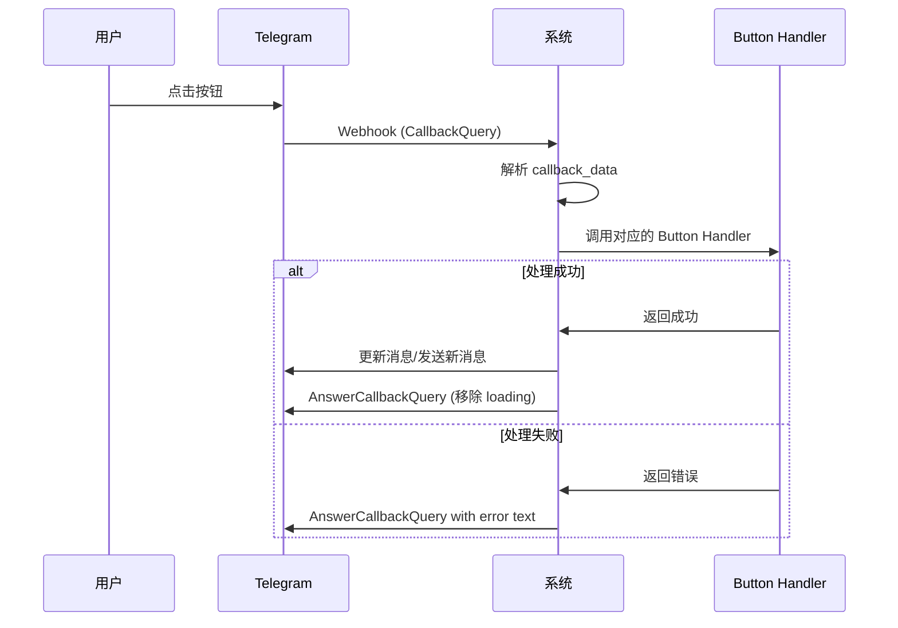

# Bot 按钮交互详解

本文档详细说明所有 Telegram Bot 中的按钮交互。

## 按钮类型分类

Telegram Bot 支持两种类型的按钮：

1. **Inline Keyboard Buttons（内联键盘按钮）**
   - 显示在消息下方
   - 点击触发 callback query
   - 可以有多种操作：callback_data、url、webapp 等

2. **Reply Keyboard Buttons（回复键盘按钮）**
   - 显示在输入框上方
   - 点击直接发送文本消息
   - 持久显示（除非移除）

---

## 一、Gen Bot 按钮（ShellAgent Bot）

### 1.1 SelectBot Button（选择 Bot）

**显示位置**: /mybots 命令后的 Bot 列表

**按钮文案**: `@{bot_name}`

**Callback Data 格式**: `select_bot:{bot_id}`

**功能**:
- 用户点击某个 Bot 进入详情页
- 更新消息显示 Bot 详情和操作选项

**交互流程**:
```
用户点击 @MyBot
  ↓
系统查询 Bot 详情
  ↓
更新消息为:
  "Bot Selected: @MyBot
   What would you like to do with this bot?"
  [Edit Bot 按钮]
  [<<Back To Bot List 按钮]
```

**代码位置**: `internal/domain/service/tg2app/tg_gen_buttons/tg_gen_button.select_bot.service.go`

**按钮布局**:
- 每行最多2个 Bot 按钮
- 使用 2 列网格布局

**示例**:
```
[ @Bot1 ]  [ @Bot2 ]
[ @Bot3 ]  [ @Bot4 ]
[ @Bot5 ]
```

---

### 1.2 EditBot Button（编辑 Bot）

**显示位置**: 选择 Bot 后的详情页

**按钮文案**: `Edit Bot`

**Callback Data 格式**: `edit_bot:{bot_id}`

**功能**:
- 设置该 Bot 为用户的当前 Bot
- 重置用户状态为 IDLE
- 用户可以开始通过发送消息来编辑 Bot

**交互流程**:
```
用户点击 Edit Bot
  ↓
更新 tg2app_user_current_bot_ids 表
  ↓
设置用户状态为 IDLE
  ↓
发送确认消息:
  "✅ You've selected {bot_name}
   📝 Bot Description: {description}
   🚀 Just type in the chat box to let the AI edit the bot."
  ↓
回答 Callback Query (移除 loading 状态):
  "✨ Bot selected successfully!"
```

**代码位置**: `internal/domain/service/tg2app/tg_gen_buttons/tg_gen_button.edit_bot.service.go`

**后续行为**:
- 用户可以直接在聊天框输入文本
- 系统将输入作为编辑指令处理
- 触发 Bot 生成流程

---

### 1.3 BackToBot List Button（返回 Bot 列表）

**显示位置**: Bot 详情页

**按钮文案**: `<<Back To Bot List`

**Callback Data 格式**: `mybots`

**功能**:
- 返回到 Bot 列表界面
- 重新显示所有 Bot 按钮

**交互流程**:
```
用户点击 <<Back To Bot List
  ↓
查询用户的所有 Bot
  ↓
更新消息为 Bot 列表界面
```

**代码位置**: `internal/domain/service/tg2app/tg_gen_buttons/tg_gen_button.back_to_bot_list.service.go`

---

### 1.4 DeployBot Button（部署 Bot）

**显示位置**: Bot 生成/编辑完成后的消息

**按钮文案**: `Deploy Bot`

**Callback Data 格式**: `deploy_bot:{bot_id}`

**功能**:
- 将 Bot 部署到生产环境
- 设置 Telegram Webhook
- 使 Bot 可供终端用户使用

**交互流程**:
```
用户点击 Deploy Bot
  ↓
调用 miniappService.HandleDeployBot()
  ↓
设置 Telegram Webhook
  ↓
更新 Bot 状态为 Running
  ↓
移除按钮（编辑消息移除 ReplyMarkup）
  ↓
发送成功消息:
  "🚀 Bot @{bot_name} has been deployed successfully!"
  ↓
记录埋点事件: Tg2AppDeployBotSuccess
```

**代码位置**: `internal/domain/service/tg2app/tg_gen_buttons/tg_gen_button.deploy_bot.service.go`

**注意事项**:
- 部署后按钮会被移除（避免重复部署）
- 需要验证 Bot 存在
- 需要验证 Bot Token 有效

---

### 1.5 Buy Energy Button（购买能量）

**显示位置**:
- 能量不足提示消息
- Energy DeepLink 启动消息

**按钮类型**: URL Button 或 WebApp Button

**按钮文案**:
- `Buy Energy` (Gen Bot 场景)
- `Buy Or View Energy` (DeepLink 场景)

**功能**:
- 跳转到购买能量的页面
- 或打开 Mini App 显示能量详情

**URL 格式**:
- DeepLink: 跳转到 ShellAgent Bot 的特定页面
- WebApp: 打开 Mini App
  - Staging: `https://telegram-miniapp.myshell.fun/profile`
  - Production: `https://tg-workshop.myshell.ai/profile`

**交互示例**:
```
系统: ⚠️ You don't have enough energy. Please buy energy to continue.
      Remaining Energy: 0
      [Buy Energy 按钮]

用户点击 Buy Energy
  ↓
跳转到购买页面或打开 Mini App
```

**代码位置**:
- `internal/domain/service/tg2app/tg2app.tg.webhook.gen.service.go:224`
- `internal/domain/service/tg2app/tg_gen_commands/tg_gen_command.start.service.go:303-313`

---

## 二、Running Bot 按钮（用户 Bot）

### 2.1 Subscribe/Unsubscribe Button（订阅/取消订阅）

**显示位置**: /subscribe 命令后的订阅管理界面

**按钮文案**:
- 未订阅: `{task_name}`
- 已订阅: `{task_name} (subscribed)`

**Callback Data 格式**:
- 订阅: `subscribe:{task_uniq_name}`
- 取消订阅: `unsubscribe:{task_uniq_name}`

**功能**:
- 订阅或取消订阅定时任务
- 用户会在指定时间收到推送

**交互流程**:
```
用户点击 "Daily News" (未订阅)
  ↓
Callback Data: subscribe:daily_news
  ↓
保存订阅关系到数据库
  ↓
更新按钮文案为: "Daily News (subscribed)"
  ↓
更新 Callback Data 为: unsubscribe:daily_news
  ↓
发送确认提示
```

**按钮布局**:
- 每个任务占一行
- 垂直排列

**示例**:
```
[ Daily News (subscribed) ]
[ Weekly Summary ]
[ Monthly Report (subscribed) ]
```

**代码位置**: `internal/domain/service/tg2app/tg_running_buttons/tg_running_button.subscribe.cron_task.service.go`

---

### 2.2 Buy Energy Button（用户 Bot 场景）

**显示位置**: 用户在自己的 Bot 中能量不足时

**按钮文案**: `Buy Energy`

**按钮类型**: URL Button

**功能**: 跳转到 ShellAgent Bot 的能量购买页面

**URL 格式**:
```
ShellAgent Bot DeepLink with Energy source:
s_egy_v_{reason}_bn_{bot_name}

示例: s_egy_v_noenergy_bn_MyBot
```

**交互示例**:
```
用户在自己的 Bot 中发送消息
  ↓
系统检查能量不足
  ↓
系统: ⚠️ You don't have enough energy.
      Please click the button below and open workshop to buy energy
      [Buy Energy 按钮]

用户点击 Buy Energy
  ↓
跳转到 ShellAgent Bot
  ↓
ShellAgent Bot 显示购买引导
```

**代码位置**: `internal/domain/service/tg2app/tg2app.tg.webhook.running.service.go:182-194`

---

### 2.3 Fix Bug Button（修复 Bug）

**显示位置**: Bot 运行出错时（如果配置）

**按钮文案**: `Fix Bug` 或类似

**功能**: 报告 Bug 或触发修复流程

**代码位置**: `internal/domain/service/tg2app/tg_running_buttons/tg_running_button.fix_bug.service.go`

**注意**: 具体实现可能因业务需求而异

---

## 三、Reply Keyboard 按钮

### 3.1 快捷命令键盘

**显示位置**: ShellAgent Bot 的欢迎消息（返回用户）

**按钮布局**:
```
┌─────────────┬─────────────┐
│  /mybots    │  /newbot    │
├─────────────┼─────────────┤
│  /remix     │ /currentbot │
└─────────────┴─────────────┘
```

**功能**:
- 提供常用命令的快捷访问
- 点击按钮 = 发送对应命令
- 键盘持久显示在输入框上方

**显示条件**:
- 用户有至少一个 Bot
- 在欢迎消息中显示

**代码位置**: `internal/domain/service/tg2app/tg_gen_commands/tg_gen_command.start.service.go:250-259`

---

## 四、按钮交互实现细节

### 4.1 Callback Query 处理流程



### 4.2 Button Handler 注册机制

**Gen Bot Button Handlers**:
```go
// 在 tg_gen_buttons/provider.go 中注册
TgGenButtonHandlerMap{
    TgGenButtonType_SelectBot:    selectBotHandler,
    TgGenButtonType_EditBot:      editBotHandler,
    TgGenButtonType_DeployBot:    deployBotHandler,
    TgGenButtonType_BackToBotList: backToBotListHandler,
}
```

**Running Bot Button Handlers**:
```go
// 在 tg_running_buttons/provider.go 中注册
TgRunningButtonHandlerMap{
    TgRunningButtonType_Subscribe:   subscribeHandler,
    TgRunningButtonType_Unsubscribe: unsubscribeHandler,
    TgRunningButtonType_FixBug:      fixBugHandler,
}
```

### 4.3 Callback Data 解析

**格式**: `{button_type}:{parameter}`

**示例**:
- `select_bot:123456789`
- `edit_bot:123456789`
- `deploy_bot:123456789`
- `subscribe:daily_news`
- `unsubscribe:weekly_summary`

**解析代码**:
```go
func ParseButtonType(callbackData string) TgGenButtonType {
    parts := strings.Split(callbackData, ":")
    if len(parts) >= 1 {
        return TgGenButtonType(parts[0])
    }
    return ""
}

// 获取参数
parts := strings.Split(callbackData, ":")
if len(parts) >= 2 {
    parameter := parts[1]
    // 使用 parameter
}
```

### 4.4 AnswerCallbackQuery

**目的**:
- 移除按钮的 loading 状态
- 可选显示提示信息（Toast）

**使用方式**:
```go
// 简单确认（只移除 loading）
telegramService.AnswerCallbackQuery(ctx, botToken, &bot.AnswerCallbackQueryParams{
    CallbackQueryID: callbackQuery.ID,
})

// 带提示文本
telegramService.AnswerCallbackQuery(ctx, botToken, &bot.AnswerCallbackQueryParams{
    CallbackQueryID: callbackQuery.ID,
    Text:            "✨ Bot selected successfully!",
})

// 显示 Alert（弹窗）
telegramService.AnswerCallbackQuery(ctx, botToken, &bot.AnswerCallbackQueryParams{
    CallbackQueryID: callbackQuery.ID,
    Text:            "Error message",
    ShowAlert:       true,
})
```

### 4.5 更新消息

**编辑消息文本**:
```go
telegramService.EditMessageText(ctx, botToken, &bot.EditMessageTextParams{
    ChatID:      chatID,
    MessageID:   messageID,
    Text:        newText,
    ParseMode:   models.ParseModeHTML,
    ReplyMarkup: newKeyboard,
})
```

**只更新键盘**:
```go
telegramService.EditMessageReplyMarkup(ctx, botToken, &bot.EditMessageReplyMarkupParams{
    ChatID:    chatID,
    MessageID: messageID,
    ReplyMarkup: &models.InlineKeyboardMarkup{
        InlineKeyboard: [][]models.InlineKeyboardButton{},
    },
})
```

**移除键盘**:
```go
// 传入空的 InlineKeyboard 数组
ReplyMarkup: &models.InlineKeyboardMarkup{
    InlineKeyboard: [][]models.InlineKeyboardButton{},
}
```

---

## 五、按钮样式和布局

### 5.1 Inline Keyboard 布局模式

**单列布局**（订阅按钮）:
```go
[][]models.InlineKeyboardButton{
    {button1},
    {button2},
    {button3},
}
```

**双列布局**（Bot 列表）:
```go
[][]models.InlineKeyboardButton{
    {button1, button2},
    {button3, button4},
    {button5},
}
```

**多操作布局**（Bot 详情）:
```go
[][]models.InlineKeyboardButton{
    {editButton},
    {backButton},
}
```

### 5.2 按钮属性

**文本按钮（Callback）**:
```go
models.InlineKeyboardButton{
    Text:         "按钮文案",
    CallbackData: "action:param",
}
```

**URL 按钮**:
```go
models.InlineKeyboardButton{
    Text: "打开网页",
    URL:  "https://example.com",
}
```

**WebApp 按钮**:
```go
models.InlineKeyboardButton{
    Text:   "打开应用",
    WebApp: &models.WebAppInfo{URL: "https://app.example.com"},
}
```

---

## 六、按钮交互最佳实践

### 6.1 用户体验

1. **立即响应**: 总是调用 AnswerCallbackQuery 移除 loading
2. **清晰反馈**: 通过更新消息或发送新消息给用户明确反馈
3. **状态可见**: 按钮文案应反映当前状态（如 "subscribed"）
4. **防止误操作**: 重要操作后移除按钮或更新状态

### 6.2 错误处理

1. **验证数据**: 检查 callback_data 格式和参数有效性
2. **处理异常**: 捕获所有错误并友好提示用户
3. **日志记录**: 记录所有按钮交互用于调试
4. **埋点统计**: 重要操作应记录埋点事件

### 6.3 性能优化

1. **批量操作**: 尽可能一次更新完成所有状态变更
2. **缓存查询**: 复用数据库查询结果
3. **异步处理**: 耗时操作考虑异步处理，先给用户反馈

---

## 七、按钮类型映射表

| 按钮类型 | Gen Bot | Running Bot | Callback Data | 功能 |
|----------|---------|-------------|---------------|------|
| SelectBot | ✅ | ❌ | select_bot:{id} | 选择 Bot |
| EditBot | ✅ | ❌ | edit_bot:{id} | 编辑 Bot |
| DeployBot | ✅ | ❌ | deploy_bot:{id} | 部署 Bot |
| BackToBotList | ✅ | ❌ | mybots | 返回列表 |
| Subscribe | ❌ | ✅ | subscribe:{name} | 订阅任务 |
| Unsubscribe | ❌ | ✅ | unsubscribe:{name} | 取消订阅 |
| BuyEnergy | ✅ | ✅ | N/A (URL Button) | 购买能量 |
| FixBug | ❌ | ✅ | fix_bug:{id} | 报告Bug |

---

## 八、调试技巧

### 查看 Callback Data
在日志中记录所有 callback query:
```go
logger.Infof("Received callback query: %s from user: %d", callbackQuery.Data, userID)
```

### 测试按钮
1. 使用真实 Telegram 客户端测试
2. 检查 AnswerCallbackQuery 是否被调用
3. 验证消息更新是否成功
4. 观察用户体验是否流畅

### 常见问题
1. **按钮一直 loading**: 忘记调用 AnswerCallbackQuery
2. **按钮点击无响应**: Handler 未正确注册或 callback_data 解析错误
3. **消息更新失败**: MessageID 不正确或消息已被删除
