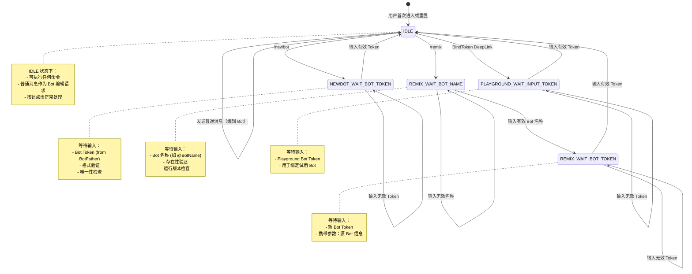
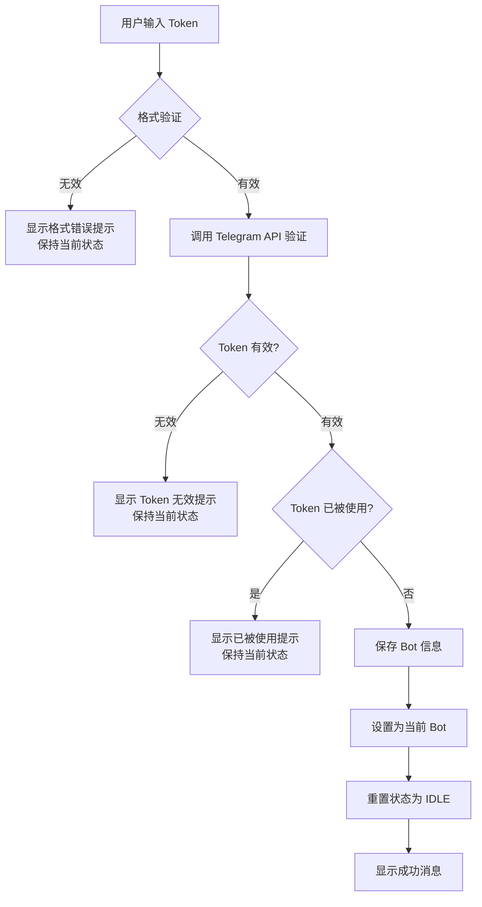
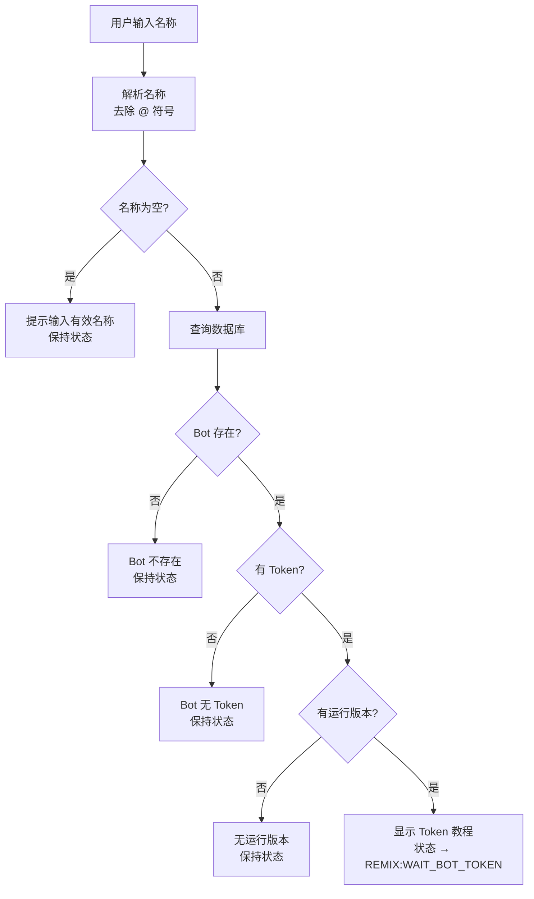
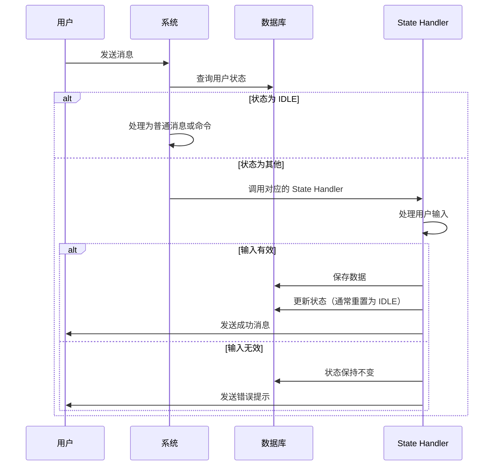

# 用户状态机详解

本文档详细说明 Telegram Bot 系统的用户状态管理机制。

## 状态机概述

系统使用状态机来管理用户在多步骤交互中的位置。当用户正在执行需要多个步骤的操作时（如创建 Bot、Remix Bot），系统会跟踪用户所处的状态，并根据状态处理用户输入。

### 存储位置
- **表**: `tg2app_user_states`
- **缓存**: Redis
- **字段**:
  - `user_id`: 用户 ID
  - `state`: 当前状态（枚举值）
  - `state_params`: 状态参数（JSON 字符串）
  - `updated_at`: 更新时间

---

## 状态定义

### UserState 枚举

```go
type UserState string

const (
    UserState_IDLE                              UserState = "IDLE"
    UserState_NEWBOT_WAIT_USER_INPUT_BOT_TOKEN  UserState = "NEWBOT:WAIT_USER_INPUT_BOT_TOKEN"
    UserState_REMIX_WAIT_USER_INPUT_BOT_NAME    UserState = "REMIX:WAIT_USER_INPUT_BOT_NAME"
    UserState_REMIX_WAIT_USER_INPUT_BOT_TOKEN   UserState = "REMIX:WAIT_USER_INPUT_BOT_TOKEN"
    UserState_PLAYGROUND_WAIT_USER_INPUT_TOKEN  UserState = "PLAYGROUND:WAIT_USER_INPUT_TOKEN"
)
```

---

## 状态流转图



---

## 状态详解

### 1. IDLE（空闲状态）

**定义**: 用户的默认状态，没有正在进行的多步骤操作

**行为**:
- 用户可以执行任何命令
- 普通消息被视为 Bot 编辑/生成请求
- 按钮交互正常处理

**进入条件**:
- 用户首次注册
- 完成任何多步骤操作后
- 执行 Edit Bot 操作后
- 手动重置状态

**状态参数**: `{}` (空 JSON)

**代码位置**: 所有 state handler 完成后都会重置为此状态

**示例场景**:
```
用户: /currentbot
Bot: 显示当前 Bot 信息 (用户仍处于 IDLE 状态)

用户: 帮我添加一个新功能
Bot: 开始处理 Bot 生成请求 (用户仍处于 IDLE 状态)
```

---

### 2. NEWBOT:WAIT_USER_INPUT_BOT_TOKEN

**定义**: 等待用户输入新 Bot 的 Token

**进入条件**:
- 用户执行 `/newbot` 命令

**等待输入**: Bot Token（从 @BotFather 获取）

**验证流程**:


**状态参数**: `{}` (空 JSON)

**成功后**:
- 保存 Bot 到数据库
- 设置为用户的当前 Bot
- 状态重置为 IDLE
- 显示成功消息

**失败重试**:
- 保持在当前状态
- 用户可以重新输入 Token

**代码位置**: `internal/domain/service/tg2app/tg_gen_states/newbot.wait_bot_token.state.service.go`

**示例交互**:
```
用户: /newbot
Bot: [显示教程]
系统: 设置状态 = NEWBOT:WAIT_USER_INPUT_BOT_TOKEN

用户: 123:invalid
Bot: ❌ Invalid bot token format
系统: 状态保持不变

用户: 7089876543:AAH3wE9x-aAbBcCdD1234567890aBcDeFgH
Bot: ✅ Success! Your bot @MyBot has been successfully registered!
系统: 状态 → IDLE
```

---

### 3. REMIX:WAIT_USER_INPUT_BOT_NAME

**定义**: 等待用户输入要 Remix 的 Bot 名称

**进入条件**:
- 用户执行 `/remix` 命令

**等待输入**: Bot 名称（如 @BotName 或 BotName）

**验证流程**:


**状态参数**: `{}` (空 JSON)

**成功后**:
- 查询到有效的 Bot
- 保存源 Bot 信息到下一状态的参数中
- 转换到 `REMIX:WAIT_USER_INPUT_BOT_TOKEN` 状态
- 显示 GIF 教程和 Token 输入提示

**状态参数传递**:
```json
{
  "bot_id": 123456789,
  "webhook_url": "https://...",
  "description": "Bot description",
  "image_id": "modal-image-id"
}
```

**代码位置**: `internal/domain/service/tg2app/tg_gen_states/remix.wait_bot_name.state.service.go`

**示例交互**:
```
用户: /remix
Bot: Please enter the bot name you want to remix (e.g. @xxxxx)
系统: 状态 = REMIX:WAIT_USER_INPUT_BOT_NAME

用户: @NonExistentBot
Bot: ❌ Bot @NonExistentBot does not exist or has no bot-token
系统: 状态保持不变

用户: @AwesomeBot
Bot: [GIF 动画]
     ✅ Found Bot @AwesomeBot
     Please enter your new bot token (get it from @BotFather):
系统: 状态 → REMIX:WAIT_USER_INPUT_BOT_TOKEN
      参数 → {bot_id: xxx, webhook_url: ..., ...}
```

---

### 4. REMIX:WAIT_USER_INPUT_BOT_TOKEN

**定义**: 等待用户输入新 Bot 的 Token（用于 Remix）

**进入条件**:
- 从 `REMIX:WAIT_USER_INPUT_BOT_NAME` 状态成功找到源 Bot 后

**等待输入**: 新 Bot 的 Token

**状态参数** (从上一状态传递):
```json
{
  "bot_id": 123456789,
  "webhook_url": "https://sandbox.example.com/webhook",
  "description": "Source bot description",
  "image_id": "modal-image-xxx"
}
```

**验证流程**:
- 与 NEWBOT 状态类似，验证 Token 格式和有效性
- 额外操作：复制源 Bot 的配置

**成功后**:
1. 创建新 Bot 记录
2. 复制源 Bot 的 Sandbox 配置（ImageID）
3. 复制源 Bot 的运行版本配置（Webhook、Description）
4. 保存 Remix 关系（tg2app_bot_remixes）
5. 保存活动记录（tg2app_user_bot_activities）
6. 设置为当前 Bot
7. 重置状态为 IDLE

**Remix 关系保存**:
```go
SaveBotRemixRelation(ctx,
    sourceBotID,      // 从状态参数获取
    newBotID,         // 新创建的 Bot ID
    sourceBotUserID,  // 源 Bot 的所有者
    currentUserID,    // 当前用户
)
```

**代码位置**: `internal/domain/service/tg2app/tg_gen_states/remix.wait_bot_token.state.service.go`

**示例交互**:
```
[前置状态: REMIX:WAIT_USER_INPUT_BOT_NAME 成功]
Bot: ✅ Found Bot @AwesomeBot
     Please enter your new bot token...
系统: 状态 = REMIX:WAIT_USER_INPUT_BOT_TOKEN
      参数 = {bot_id: 123, webhook_url: "...", ...}

用户: 7089876543:AAH3wE9x...
Bot: ✅ Success! Your bot @MyAwesomeBot has been created based on @AwesomeBot
系统: 状态 → IDLE
      创建新 Bot 记录
      复制 Sandbox 配置
      复制运行版本
      保存 Remix 关系
```

---

### 5. PLAYGROUND:WAIT_USER_INPUT_TOKEN

**定义**: 等待用户输入 Playground Bot 的 Token（绑定 Token 场景）

**进入条件**:
- 用户通过 BindToken DeepLink 启动 Bot
- DeepLink 格式: `s_bdt_v_{value}_bid_{bot_id}`

**等待输入**: Bot Token（用于绑定到 Playground Bot）

**状态参数**:
```json
{
  "bot_id": 987654321
}
```

**功能**:
- 允许用户将自己的 Bot Token 绑定到试用的 Playground Bot
- 用于测试和演示目的

**验证流程**:
- 类似 NEWBOT 状态
- Token 格式验证
- Token 有效性验证
- 保存并绑定到指定的 Bot ID

**代码位置**: `internal/domain/service/tg2app/tg_gen_states/playground.wait_bot_token.state.service.go`

**示例交互**:
```
用户点击 DeepLink: s_bdt_v_bind_bid_987654321
Bot: [显示 Token 教程]
系统: 状态 = PLAYGROUND:WAIT_USER_INPUT_TOKEN
      参数 = {bot_id: 987654321}

用户: 7089876543:AAH3wE9x...
Bot: ✅ Token has been successfully bound to the bot!
系统: 状态 → IDLE
```

---

## 状态处理机制

### State Handler 接口

```go
type TgGenStateHandler interface {
    HandleState(ctx context.Context, userId int64, currentStateParams string, update *models.Update) error
}
```

### State Handler Map

```go
TgGenStateHandlerMap{
    UserState_NEWBOT_WAIT_USER_INPUT_BOT_TOKEN:  newbotWaitTokenHandler,
    UserState_REMIX_WAIT_USER_INPUT_BOT_NAME:    remixWaitNameHandler,
    UserState_REMIX_WAIT_USER_INPUT_BOT_TOKEN:   remixWaitTokenHandler,
    UserState_PLAYGROUND_WAIT_USER_INPUT_TOKEN:  playgroundWaitTokenHandler,
}
```

### 处理流程



### 状态查询和设置

**查询状态**:
```go
func (repo *Tg2AppUserStatesRepository) GetUserState(ctx context.Context, userID int64) (UserState, string, error) {
    // 返回: (状态枚举, 状态参数JSON, error)
}
```

**设置状态**:
```go
func (repo *Tg2AppUserStatesRepository) SetUserStateWithParams(ctx context.Context, userID int64, state UserState, params *string) error {
    // params: JSON 字符串指针
}
```

**重置状态**:
```go
stateParams := "{}"
repo.SetUserStateWithParams(ctx, userID, UserState_IDLE, &stateParams)
```

---

## 状态优先级

在消息处理中，状态检查的优先级为：

1. **命令检查**: 首先检查是否是 Bot 命令（以 / 开头）
2. **能量检查**: 检查用户能量余额
3. **状态检查**: 如果状态不是 IDLE，使用 State Handler 处理
4. **普通消息**: 如果状态是 IDLE，作为 Bot 编辑请求处理

```go
// 伪代码
if isCommand(message) {
    handleCommand(message)
} else if userEnergy == 0 {
    showEnergyWarning()
} else if userState != IDLE {
    stateHandler.HandleState(userState, message)
} else {
    handleBotEditRequest(message)
}
```

---

## 状态超时和清理

### 超时机制

**当前实现**: 无自动超时，状态会一直保持直到：
- 用户完成操作
- 用户执行新命令（某些命令会重置状态）
- 手动重置

**建议改进**: 可以添加超时机制
- 设置状态时记录时间戳
- 超过一定时间（如 30 分钟）自动重置为 IDLE
- 使用 Redis TTL 实现自动过期

### 状态清理

**手动清理场景**:
- 用户点击 Edit Bot 按钮 → 重置为 IDLE
- 用户完成 Bot 创建 → 重置为 IDLE
- 用户完成 Remix → 重置为 IDLE

---

## 状态参数设计

### 参数格式

所有状态参数都使用 JSON 字符串存储：

**空参数**:
```json
{}
```

**Remix 状态参数**:
```json
{
  "bot_id": 123456789,
  "webhook_url": "https://sandbox.example.com/webhook",
  "description": "Bot description text",
  "image_id": "modal-image-xxx"
}
```

**Playground 状态参数**:
```json
{
  "bot_id": 987654321
}
```

### 参数解析

```go
type RemixBotStateParams struct {
    BotID       int64  `json:"bot_id"`
    WebhookURL  string `json:"webhook_url"`
    Description string `json:"description"`
    ImageID     string `json:"image_id"`
}

var params RemixBotStateParams
json.Unmarshal([]byte(stateParamsJSON), &params)
```

### 参数更新

```go
params := RemixBotStateParams{
    BotID:       sourceBotID,
    WebhookURL:  webhookURL,
    Description: description,
    ImageID:     imageID,
}
paramsJSON, _ := json.Marshal(params)
paramsStr := string(paramsJSON)

repo.SetUserStateWithParams(ctx, userID, UserState_REMIX_WAIT_USER_INPUT_BOT_TOKEN, &paramsStr)
```

---

## 调试和监控

### 日志记录

**状态转换日志**:
```go
logger.Infof("User %d state changed: %s -> %s, params: %s",
    userID, oldState, newState, stateParams)
```

**State Handler 执行日志**:
```go
logger.Infof("Executing state handler for user %d, state: %s, input: %s",
    userID, currentState, userInput)
```

### 埋点事件

**状态进入**:
```go
bizTracker.TrackUserId(ctx, "Tg2App_EnterState", userID, map[string]interface{}{
    "state": string(newState),
})
```

**状态完成**:
```go
bizTracker.TrackUserId(ctx, "Tg2App_CompleteState", userID, map[string]interface{}{
    "state": string(completedState),
    "success": true,
})
```

### 常见问题诊断

**问题1**: 用户卡在某个状态，无法执行其他操作
- **原因**: 状态未正确重置为 IDLE
- **解决**: 检查 State Handler 是否在所有成功/失败路径中都更新了状态

**问题2**: 状态参数丢失
- **原因**: 状态转换时未正确传递参数
- **解决**: 确保在状态转换时设置正确的参数 JSON

**问题3**: 用户输入被错误处理
- **原因**: 状态检查优先级不正确
- **解决**: 确保状态检查在命令检查之后，普通消息处理之前

---

## 扩展新状态

### 步骤

1. **定义状态枚举**:
```go
const (
    UserState_MY_NEW_STATE UserState = "MY_NEW_STATE:DESCRIPTION"
)
```

2. **创建 State Handler**:
```go
type MyNewStateHandler struct {
    // 依赖注入
}

func (h *MyNewStateHandler) HandleState(ctx context.Context, userId int64, stateParams string, update *models.Update) error {
    // 处理逻辑
}
```

3. **注册 Handler**:
```go
// 在 provider.go 中
TgGenStateHandlerMap{
    // ...
    UserState_MY_NEW_STATE: myNewStateHandler,
}
```

4. **设置状态入口**:
```go
// 在适当的 Command Handler 或 Button Handler 中
repo.SetUserStateWithParams(ctx, userID, UserState_MY_NEW_STATE, &params)
```

### 最佳实践

1. **清晰的状态命名**: 使用 `{流程}:WAIT_{等待内容}` 格式
2. **完整的错误处理**: 处理所有可能的输入情况
3. **友好的用户提示**: 明确告诉用户需要输入什么
4. **状态重置**: 完成后总是重置为 IDLE
5. **参数传递**: 使用结构化的 JSON 参数
6. **日志和埋点**: 记录所有状态转换和关键操作
