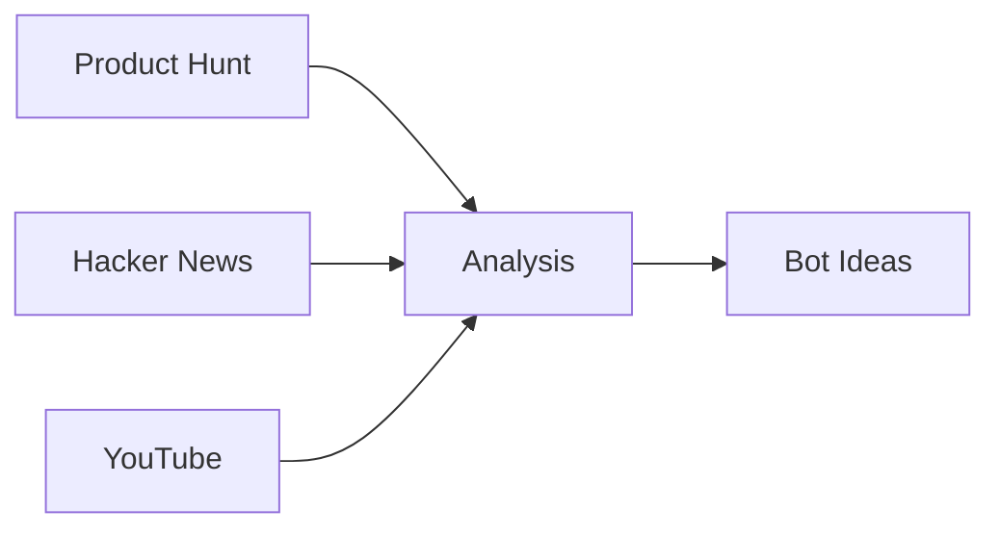

# Vertical Bot Research Agent

An AI-powered research agent that identifies high-potential Telegram bot use cases for specific verticals by analyzing Product Hunt, Hacker News, YouTube, and GitHub.

## 🎯 Purpose

Help identify what Telegram bots to build for specific target audiences (content creators, fitness coaches, developers, etc.) by:
1. Analyzing trending automation tools across multiple platforms
2. Understanding real user pain points and workflows
3. Filtering ideas by Telegram bot capabilities
4. Generating actionable implementation roadmaps

## 🏗️ Architecture

```
┌─────────────────────────────────────────────────────────────┐
│                   Vertical Bot Research Agent                │
└─────────────────────────────────────────────────────────────┘
                              │
                    ┌─────────┴─────────┐
                    │   Input Vertical   │
                    │ (e.g., "content    │
                    │    creators")      │
                    └─────────┬─────────┘
                              │
        ┌─────────────────────┼─────────────────────┐
        │                     │                     │
        ▼                     ▼                     ▼
┌──────────────┐      ┌──────────────┐     ┌──────────────┐
│ Product Hunt │      │ Hacker News  │     │   YouTube    │
│   (Tavily)   │      │   (MCP)      │     │   (Tavily)   │
└──────┬───────┘      └──────┬───────┘     └──────┬───────┘
       │                     │                     │
       │  Trending Tools     │  Pain Points        │  Workflows
       │                     │  Discussions        │  Tutorials
       └─────────────────────┼─────────────────────┘
                             │
                    ┌────────▼────────┐
                    │  Analysis Engine │
                    │  ├─ Technical    │
                    │  │  Feasibility   │
                    │  ├─ Market        │
                    │  │  Validation    │
                    │  └─ Remix         │
                    │     Potential     │
                    └────────┬─────────┘
                             │
                    ┌────────▼────────┐
                    │ Structured Report│
                    │  5-10 Bot Ideas  │
                    │  + Roadmap       │
                    └──────────────────┘
```

## 📦 Project Structure

```
use_case_bot_search/
├── .claude/
│   └── skills/
│       └── vertical-bot-research/
│           └── SKILL.md                 # Main agent definition
├── runs/
│   └── YYYY-MM-DD-[vertical]-test/
│       ├── child_outputs/               # Individual source research
│       │   ├── producthunt.md
│       │   ├── youtube.md
│       │   └── hackernews.md
│       ├── raw/                         # Cached API responses
│       ├── logs/                        # Execution logs
│       └── final_report.md              # Main deliverable
├── wide_research_prompt.md              # Research methodology
├── product_context.md                   # Telegram bot platform context
├── EXECUTION_PLAN.md                    # Detailed usage guide
└── README.md                            # This file
```

## 🚀 Quick Start

### Prerequisites

1. **Claude Code** installed with MCP servers:
   - ✅ Product Hunt MCP
   - ✅ Hacker News MCP
   - ✅ YouTube Transcript MCP
   - ✅ Tavily Search MCP
   - ✅ Reddit MCP (optional)
   - ✅ GitHub MCP (optional)

2. Navigate to project directory:
```bash
cd "/Users/hancezhang/Claude code exp/use_case_bot_search"
```

### Basic Usage

Start Claude Code and trigger the research agent:

```
Research Telegram bot use cases for content creators
```

The agent will automatically:
1. Search Product Hunt for automation tools
2. Analyze Hacker News discussions
3. Find YouTube tutorials on workflows
4. Generate 5-10 bot ideas with scores
5. Provide implementation roadmap

### Expected Output (45-55 minutes)

```
runs/YYYY-MM-DD-content-creators-test/
├── child_outputs/
│   ├── producthunt.md          # 10 automation tools found
│   ├── youtube.md              # 8 workflow tutorials analyzed
│   └── hackernews.md           # Top stories + comments
├── final_report.md             # 7 bot ideas with scores
└── aggregated_raw.md           # Full audit trail
```

## 📊 Test Results (2025-10-24)

### Vertical: Content Creators
**Research Duration**: 45 minutes
**Data Sources**: Product Hunt (10 tools), YouTube (8 videos), Hacker News (10 stories)

### Top 3 Bot Ideas Generated

1. **Caption Remix Bot** 📝
   - Technical: 5/5, Market: 5/5, Remix: 5/5
   - Generate platform-optimized captions from voice notes
   - **Time Saved**: 2.5-5 hours/week per creator

2. **Video Metadata Generator** 🎬
   - Technical: 4/5, Market: 5/5, Remix: 4/5
   - Auto-generate YouTube titles, descriptions, tags from URL
   - **Market Validation**: 9,584 YouTube views on tutorial

3. **Content Repurpose Bot** ♻️
   - Technical: 5/5, Market: 4/5, Remix: 5/5
   - Transform 1 YouTube video → 10 platform-specific posts
   - **Pain Point**: "I spend 3 hours adapting content manually"

**Full Report**: [final_report.md](runs/2025-10-24-content-creators-test/final_report.md)

## 🎨 Example Use Cases

### For Different Verticals

```bash
# Content Creators
Research Telegram bot use cases for YouTube creators

# Fitness Professionals
Research Telegram bot use cases for fitness coaches

# Developers
Research Telegram bot use cases for software developers focusing on productivity

# Educators
Research Telegram bot use cases for online teachers and course creators

# Comparative Research
Compare bot opportunities for fitness coaches vs nutrition coaches
```

### Advanced Queries

```bash
# Niche-Specific
Research Telegram bots for podcast editors focusing on audio workflow automation

# Feature-Focused
Research content creator bots but prioritize technical feasibility over market size

# Platform-Specific
Research Instagram automation bots for influencers with 10K-100K followers
```

## 🛠️ Technical Capabilities

### What Telegram Bots Can Do

| Capability | Feasibility | Example |
|------------|-------------|---------|
| CRUD Mini Apps | ⭐⭐⭐⭐⭐ | Habit tracker, expense logger |
| LUI Chat Interface | ⭐⭐⭐⭐⭐ | Q&A bot, conversational planner |
| Image Generation | ⭐⭐⭐⭐⭐ | AI art bot, thumbnail creator |
| Video Generation | ⭐⭐⭐⭐☆ | Short video creator, montages |
| Modal Conversion | ⭐⭐⭐⭐⭐ | Voice→text, video→summary |
| Data Scraping | ⭐⭐⭐⭐⭐ | RSS reader, price tracker |
| External APIs | ⭐⭐⭐⭐⭐ | Weather, stocks, calendar |
| Scheduled Tasks | ⭐⭐⭐⭐⭐ | Daily reminders, recurring reports |
| Group Bots | ⭐⭐⭐⭐⭐ | Moderation, auto-welcome |

### What Telegram Bots Cannot Do

- ❌ Real-time collaborative editing
- ❌ Complex B2B SaaS products
- ❌ Heavy compute (video rendering, ML training)
- ❌ Native mobile features (AR, camera filters)

## 📈 Success Metrics

After research, evaluate output quality:

- [ ] **Quantity**: 5-10 bot ideas documented
- [ ] **Quality**: Each idea has Technical + Market scores
- [ ] **Actionability**: Clear "Quick Win" identified
- [ ] **Sources**: All claims have verifiable links
- [ ] **Differentiation**: Ideas aren't duplicates of existing bots
- [ ] **Feasibility**: All ideas score ≥3/5 on technical feasibility

## 🔄 Agent Workflow

### Phase 1: Data Collection (20-30 min)


**Parallel Execution**:
- 4-6 MCP tool calls per batch
- 2-3 batches total
- Results saved to `child_outputs/`

### Phase 2: Analysis (10-15 min)

For each discovered tool/workflow:
1. **Technical Fit**: Can Telegram do this? (1-5 score)
2. **Market Validation**: Is there demand? (1-5 score)
3. **Remix Potential**: Can users customize? (1-5 score)

### Phase 3: Report Generation (10 min)

Structured markdown with:
- Executive summary (top 3 ideas)
- Detailed analysis (5-10 bot ideas)
- Implementation roadmap (Quick Win → High Impact → Moonshot)
- Risks & limitations

## 🎯 Key Insights from Test Run

### Market Patterns
1. **Automation > Creation**: Creators want tools to automate repetitive tasks (titles, captions), not replace their creativity
2. **Time Savings > Features**: "Saves 5 hours/week" resonates more than feature lists
3. **Platform-Specific**: One-size-fits-all doesn't work (IG ≠ TikTok ≠ YouTube)
4. **Voice Consistency**: Top request is maintaining brand voice across content

### Technical Patterns
1. **Voice Input**: Creators prefer talking over typing
2. **Multi-Output**: 1 input → multiple variations (for A/B testing)
3. **Platform Buttons**: Select IG/TikTok/YouTube with buttons (not text)
4. **Copy-Paste**: Output must be easy to copy to other apps

### Competitive Landscape
- **Existing Tools**: Canva, Notion, Later dominate but are web-based
- **Our Edge**: Telegram-native (mobile-first, faster), AI-first (smarter), Remix culture
- **Price Gap**: Competitors charge $13-80/month, we target $4-25/month

## 🚧 Limitations & Risks

### Technical Risks
- **Rate Limits**: YouTube/Instagram APIs have quotas
- **Execution Time**: Some tasks may take 60+ seconds
- **Quality Variance**: LLM outputs can be inconsistent

### Market Risks
- **Competition**: Canva, Notion, Later already established
- **Creator Fatigue**: Automation tools are oversaturated
- **Platform Changes**: APIs may change or restrict access

### Mitigation Strategies
- User-level rate limiting
- Set expectations on processing time
- Human-in-the-loop editing
- Focus on Telegram-native UX advantage
- Build modular (easy to swap APIs)

## 📚 Resources

- **SKILL Definition**: [.claude/skills/vertical-bot-research/SKILL.md](.claude/skills/vertical-bot-research/SKILL.md)
- **Execution Guide**: [EXECUTION_PLAN.md](EXECUTION_PLAN.md)
- **Research Methodology**: [wide_research_prompt.md](wide_research_prompt.md)
- **Product Context**: [product_context.md](product_context.md)
- **Test Report**: [runs/2025-10-24-content-creators-test/final_report.md](runs/2025-10-24-content-creators-test/final_report.md)

## 🤝 Contributing

This agent is designed for internal use but can be adapted for other research tasks. Key components:

1. **SKILL.md**: Agent behavior and instructions
2. **MCP Tools**: Data collection (Product Hunt, HN, YouTube)
3. **Analysis Logic**: Technical feasibility + market validation scoring
4. **Report Template**: Structured markdown output

## 📝 Next Steps

After running research:

1. **Validate** (2-3 days): Post top 3 ideas in target community
2. **Prototype** (1 week): Build simplest bot using Playground
3. **Test** (2 weeks): Beta with 5-10 users
4. **Launch** (1 month): Publish to Telegram bot directory

## 🎉 Test Run Success

✅ **Agent Deployed**: Vertical Bot Research SKILL.md created
✅ **Test Executed**: Content creators vertical researched
✅ **Data Collected**: 3 sources (Product Hunt, YouTube, Hacker News)
✅ **Report Generated**: 7 bot ideas with scores + roadmap
✅ **Execution Time**: ~45 minutes (within target)

**Agent is ready for production use!**

---

**Last Updated**: 2025-10-24
**Agent Version**: 1.0
**Test Status**: ✅ Passed
